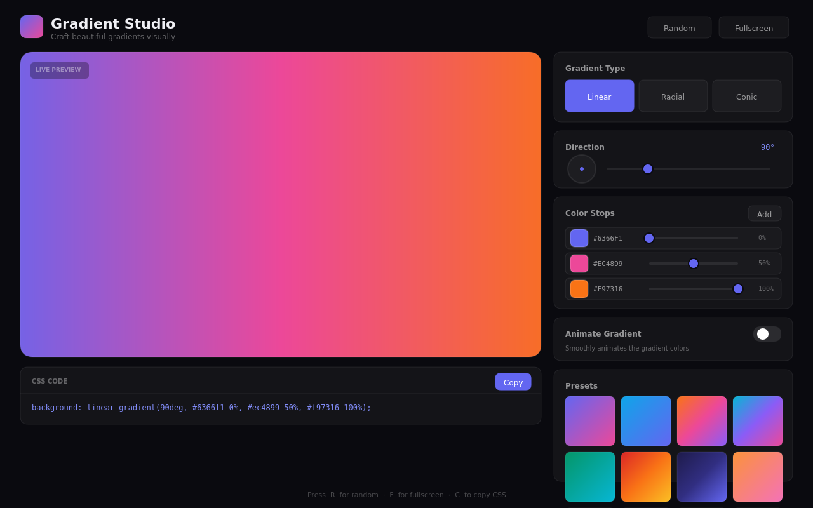
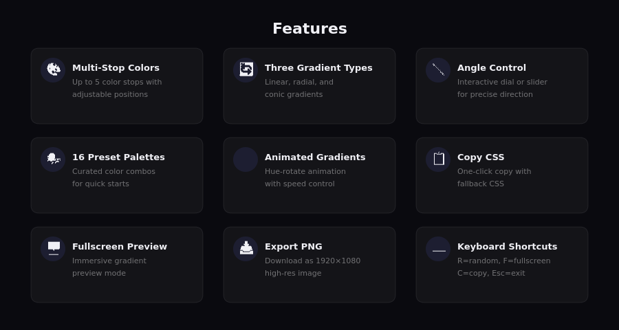
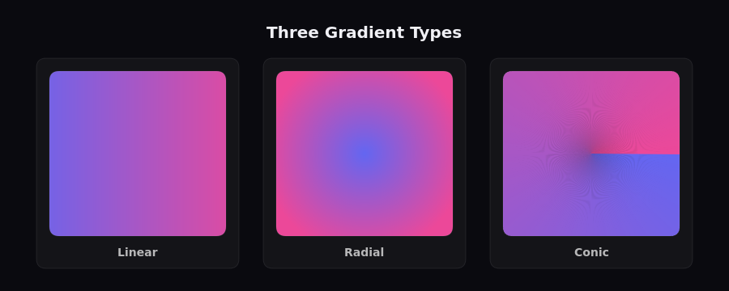
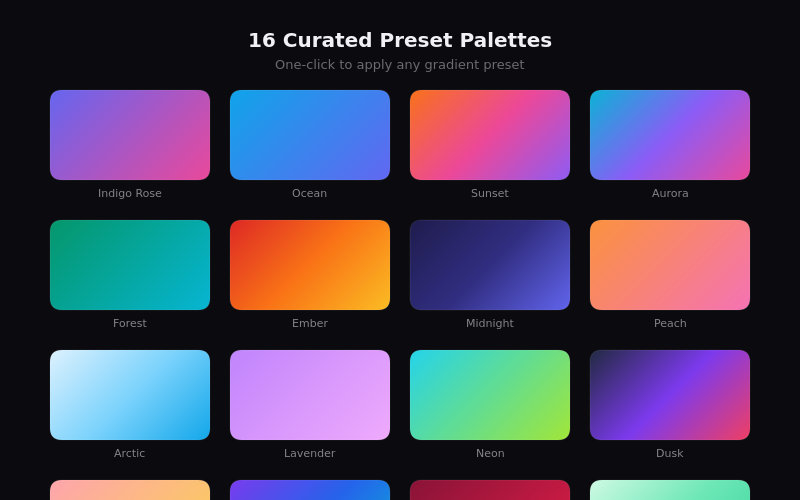
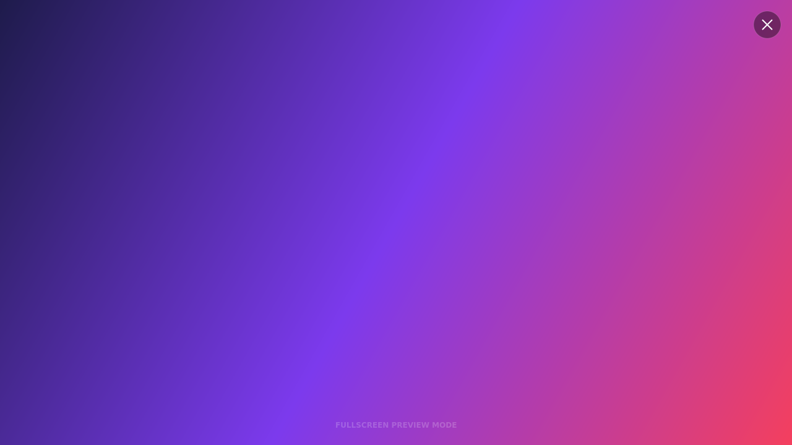

# Gradient Studio

A modern, visually stunning gradient design tool built with vanilla HTML, CSS, and JavaScript. Craft beautiful CSS gradients with an intuitive dark-themed interface, export them as images, or copy the CSS directly to your clipboard.



---

## Features



### Three Gradient Types

Create linear, radial, and conic gradients with real-time preview.



### Multi-Stop Colors

Add up to **5 color stops** with individually adjustable positions. Each stop has a color picker, hex input, and position slider for precise control.

### Interactive Angle Control

Use the **draggable dial** or range slider to set the exact gradient direction. The dial supports click-and-drag interaction for a tactile experience.

### 16 Curated Preset Palettes

Jump-start your design with hand-picked gradient presets — from Indigo Rose to Neon to Midnight.



### Animated Gradients

Toggle gradient animation with adjustable speed (1–15 seconds). The hue-rotate animation produces mesmerizing shifting colors, and the generated CSS includes the `@keyframes` rule.

### Fullscreen Preview

Immerse yourself in the gradient with a distraction-free fullscreen mode.



### Export Options

- **Copy CSS** — One-click copy to clipboard with toast confirmation. Includes a fallback color and the full gradient declaration.
- **Download PNG** — Export as a high-resolution 1920×1080 PNG image, perfect for wallpapers or design assets.

### Keyboard Shortcuts

| Key | Action |
|-----|--------|
| `R` | Generate a random gradient |
| `F` | Toggle fullscreen preview |
| `C` | Copy CSS to clipboard |
| `Esc` | Exit fullscreen |

---

## Tech Stack

| Technology | Purpose |
|---|---|
| **HTML5** | Semantic structure |
| **CSS3** | Custom properties, glassmorphism, grid layout, animations |
| **Vanilla JavaScript** | IIFE module pattern, Canvas API for PNG export, Clipboard API |

**Zero dependencies.** No frameworks, no build tools — just open `index.html` in a browser.

---

## Getting Started

### Quick Start

1. Clone the repository:
   ```bash
   git clone https://github.com/karandeepbhardwaj/Background-Generator.git
   ```
2. Open `index.html` in your browser — that's it!

### Project Structure

```
Background-Generator/
├── index.html          # Main HTML page
├── style.css           # All styles (dark theme, responsive)
├── script.js           # Application logic
├── screenshots/        # Project screenshots
│   ├── main-ui.png
│   ├── features.png
│   ├── gradient-types.png
│   ├── presets.png
│   └── fullscreen.png
└── README.md
```

---

## Design Highlights

- **Dark glassmorphism UI** with subtle card borders and backdrop effects
- **Inter** for UI typography, **JetBrains Mono** for code output
- **Indigo accent** (#6366f1) with glow effects on interactive elements
- **Smooth micro-animations** — fade-slide for new color stops, scale on hover for presets, glow on focus
- **Fully responsive** — adapts from mobile (480px) to ultrawide displays

---

## Browser Support

Works in all modern browsers:

- Chrome / Edge 90+
- Firefox 90+
- Safari 15+

> Conic gradients and the Canvas `createConicGradient` API require modern browser versions.

---

## License

MIT
